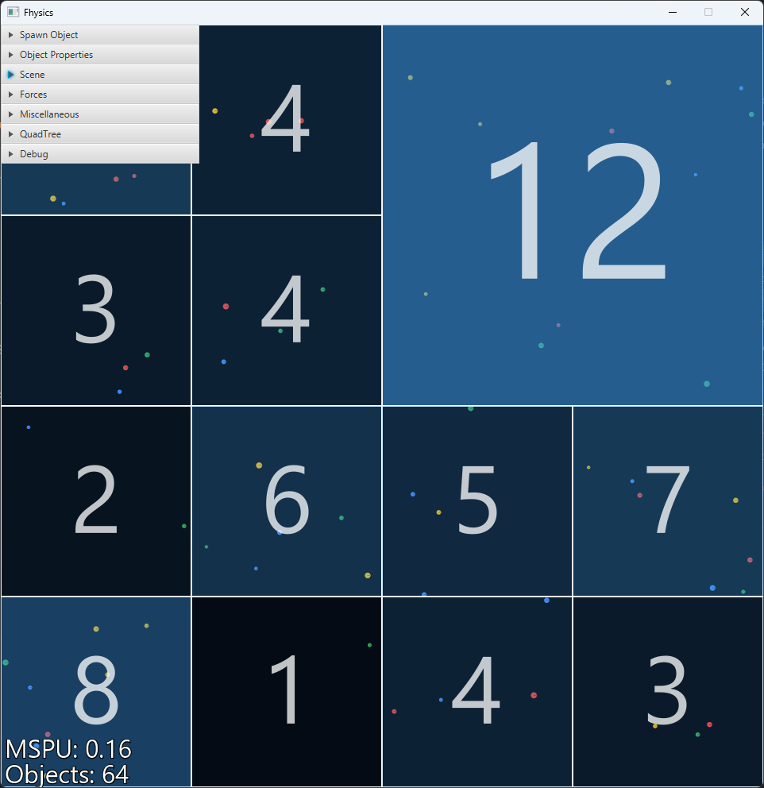

# Fhysics

This project is a physics engine implemented in Kotlin. It provides functionality for movement, rotation and collision
detection of rigid-bodies in a 2D environment. The engine is designed to be customizable at runtime through the provided
user interface.

## Table of Contents

- [Status](#Status)
- [Features](#features)
- [Why the Name?](#why-the-name)
- [Controls](#controls)
- [Screenshots](#screenshots)
- [Special Thanks](#special-thanks)
- [License](#license)

## Status

This project is `completed`. The engine is fully functional and can be used to simulate physics in a 2D environment.
Future updates may include additional features, optimizations and bug fixes.

## Features

- **Object collisions** considering friction, rotation, and elasticity
- **Border collisions** considering friction, rotation, and elasticity
- **Gravity** (directional or towards a point)
- **Various shapes** (circle, rectangle, convex and concave polygons)
- **QuadTree** data structure for efficient collision detection
- **Real-time** simulation and visualization
- **Customizable physics** parameters (e.g., gravity strength/direction; collision elasticity & friction coefficients (
  per object); ...)
- **User interface** for easier interactions and visual elements
- **Debug visuals** for debugging and deeper insights of the inner workings of the engine
- **Camera controls** for panning and zooming

## Why the Name?

As a big Star Wars fan, I initially wanted to call it "Force-Physics," but that felt too lengthy. Inspired by NVIDIA's "PhysX" engine, I decided to shorten it while maintaining the phonetic sound of "physics." Hence, "Fhysics" was born.

## Controls

### Mouse

- `LeftClick`: Spawn circle/rectangle (when in circle/rectangle creation mode)
- `LeftClick`: Add vertex to polygon (when in polygon creation mode)
- `LeftClick + Drag`: Create rectangle from start point to release point (when in rectangle creation mode)
- `LeftClick + Drag (on object)`: Drag the object with the mouse
- `LeftClick (on object)`: Select object
- `RightClick`: Reset polygon creation
- `RightClick + Drag`: Pan camera
- `Scroll`: Zoom camera

### Keyboard

- `P`: Toggle simulation pause/play
- `Enter`: Step the simulation forward (when paused)
- `S`: Print selected object details
- `Delete`: Remove selected object
- `Z`: Reset camera zoom and position
- `H`: Decrease QuadTree capacity by 1
- `J`: Decrease QuadTree capacity by 5
- `K`: Increase QuadTree capacity by 5
- `L`: Increase QuadTree capacity by 1
- `Q`: Print QuadTree structure

## Screenshots

<table>
  <tr>
    <td></td>
    <td></td>
  </tr>
  <tr>
    <td></td>
    <td></td>
  </tr>
</table>

## Special Thanks

- **[Chris Hecker](https://www.chrishecker.com/Homepage)** for his
  amazing [articles](https://www.chrishecker.com/Rigid_Body_Dynamics) on rigid-body dynamics
- **[Two-Bit Coding](https://www.youtube.com/@two-bitcoding8018)** for guidance with
  his [series](https://www.youtube.com/playlist?list=PLSlpr6o9vURwq3oxVZSimY8iC-cdd3kIs) when I was stuck

## License

This project is licensed under the terms of the MIT license. See the [LICENSE](LICENSE) file for the full information.